# DandEtudeDuR

App web para estudiar lectura rítmica, en honor a *Étude du Rythme* de Georges Dandelot.

Genera ritmos en partitura según el compás y las figuras que elijas, los reproduce con un metrónomo configurable y mide tu precisión cuando los tocas sobre la partitura (con el dedo o el ratón), con el teclado o, en el móvil, con un botón grande en la parte de abajo de la pantalla.

## Qué incluye

- **Práctica libre:** compases 2/4, 3/4, 4/4, 5/4, 2/2, 3/2, 3/8, 6/8, 9/8, 12/8, 5/8, 7/8 y 8/8 (en los de amalgama eliges la agrupación: 3+2 o 2+3; 2+2+3, 2+3+2 o 3+2+2; 3+3+2, 3+2+3 o 2+3+3); de 1 a 16 compases; redonda, blanca, negra, corchea y semicorchea (con y sin puntillo) y tresillos.
- **Silencios a elección:** se eligen uno por uno, igual que las figuras: de redonda, blanca, negra, negra con puntillo, corchea y semicorchea.
- **Síncopas y ligaduras:** dos opciones independientes. Las notas ligadas no se vuelven a tocar.
- **Reproducir y metrónomo:** escucha el ritmo antes de tocarlo. Tempo de 30 a 240 ppm con indicación italiana, acento, subdivisión, cuenta previa y marcado de tempo con toques.
- **Práctica con evaluación:** en modo batería se mide el ataque de cada nota; en modo piano también cuánto la mantienes. Puedes oír tus propios toques, y los golpes de más se pueden penalizar o solo contar.
- **Resultados sobre la partitura:** cada nota muestra tu desvío, las notas sin tocar se marcan con una ✕ y los golpes de más con un triángulo en el lugar donde tocaste.
- **Medición de latencia:** calcula la corrección para tu equipo, por ejemplo con auriculares Bluetooth.
- **Campaña:** 29 niveles en 6 capítulos, del pulso en negras a las síncopas, las ligaduras y los compases de amalgama, con estrellas y desbloqueo progresivo.
- **Mi progreso:** historial de prácticas, gráfica de precisión y comparación con las prácticas anteriores.
- **Pensada también para el móvil:** la página sigue a la partitura mientras suena y, en pantallas táctiles, hay un botón flotante para tocar sin miedo a equivocarte de sitio.

## Uso

Abre `index.html` en el navegador (junto a `styles.css`, en la misma carpeta). No necesita instalación ni compilación. El progreso se guarda en el navegador.

## Cómo funciona

### 1. La pantalla principal

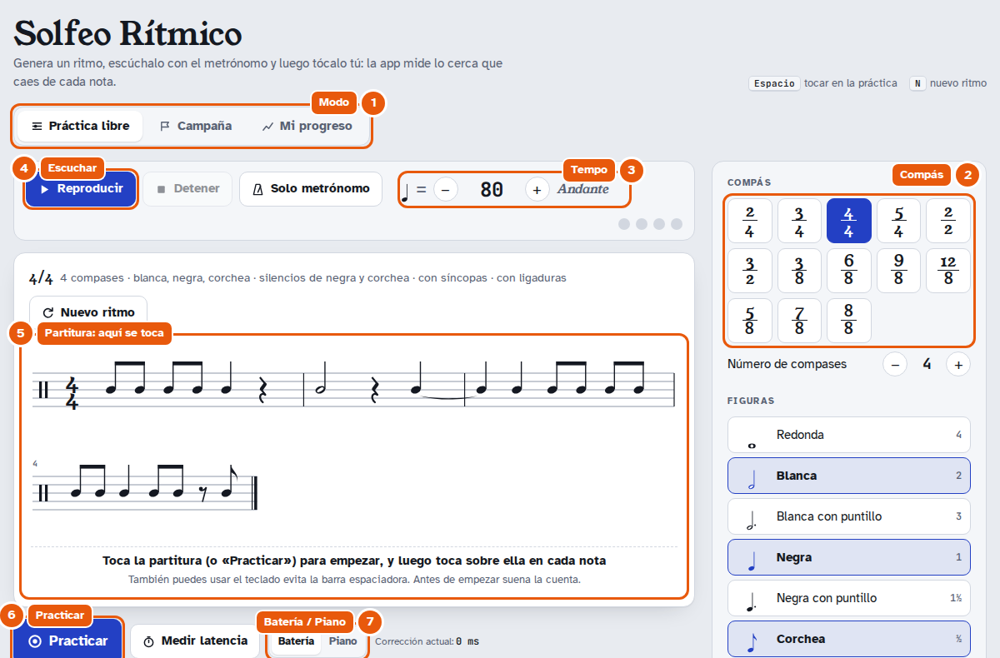

1. **Modo:** *Práctica libre* (tú eliges todo), *Campaña* (niveles guiados) o *Mi progreso*.
2. **Compás y opciones del ritmo:** en el panel de la derecha (debajo, en el móvil). Se explican en el apartado siguiente.
3. **Tempo:** con − / +, escribiendo el número o marcándolo con toques.
4. **Reproducir:** hace sonar el ritmo con el metrónomo para que lo oigas antes de practicarlo. *Nuevo ritmo* (o la tecla <kbd>N</kbd>) genera otro.
5. **Partitura:** además de leerla, es donde tocas. Tocarla en reposo también empieza la práctica.
6. **Practicar:** empieza la cuenta previa y la evaluación.
7. **Batería / Piano:** en *Batería* solo cuenta cuándo tocas cada nota; en *Piano* también cuánto la mantienes pulsada.

### 2. Opciones del ritmo

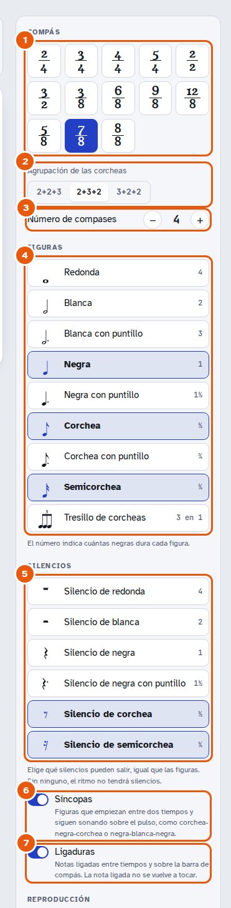

1. **Compás:** trece compases simples, compuestos y de amalgama.
2. **Agrupación:** solo en 5/8, 7/8 y 8/8. Cambia cómo se agrupan las corcheas; el metrónomo acentúa el inicio de cada grupo y las barras de las corcheas lo siguen.
3. **Número de compases:** de 1 a 16.
4. **Figuras:** pulsa para activar o desactivar cada una. El número de la derecha indica cuántas negras dura.
5. **Silencios:** igual que las figuras, uno por uno. Si un silencio no cabe en el compás (por ejemplo, el de redonda en 3/4) o necesita figuras más cortas a su lado (el de semicorchea necesita semicorcheas), la app te avisa encima de la partitura.
6. **Síncopas:** figuras que empiezan entre dos tiempos y siguen sonando sobre el pulso, como corchea-negra-corchea o negra-blanca-negra.
7. **Ligaduras:** notas ligadas entre tiempos y sobre la barra de compás.

El resumen encima de la partitura recuerda siempre qué está activo. Un ejemplo con síncopas, ligaduras y silencios de semicorchea:

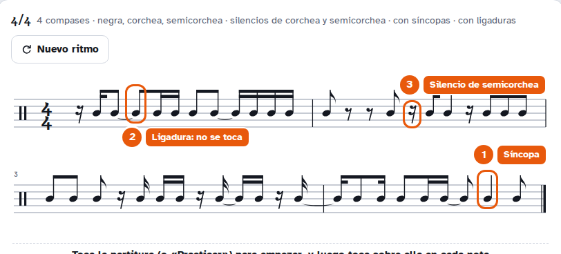

1. **Síncopa:** la negra empieza entre dos tiempos; tócala en el «y».
2. **Ligadura:** la segunda nota no se toca; alarga la anterior.
3. **Silencio de semicorchea:** un cuarto de tiempo sin tocar.

### 3. Sonido y práctica

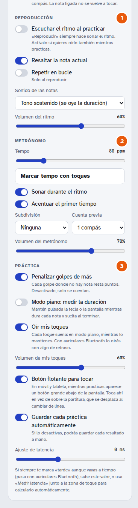

1. **Reproducción:** *Reproducir* siempre hace sonar el ritmo; *Escuchar el ritmo al practicar* lo hace sonar también mientras practicas (viene apagada, para que lo leas tú). También: resaltar la nota actual, repetir en bucle, sonido de las notas (tono sostenido o golpe) y volumen.
2. **Metrónomo:** tempo, marcar el tempo con toques, sonar durante el ritmo, acento en el primer tiempo, subdivisión, compases de cuenta previa y volumen.
3. **Práctica:**
   - *Penalizar golpes de más:* cada golpe donde no hay nota resta puntos; si lo desactivas, solo se cuentan.
   - *Modo piano:* igual que el selector Batería / Piano.
   - *Oír mis toques* (activado por defecto) y su volumen: en modo piano suena mientras mantienes.
   - *Botón flotante para tocar:* en móvil y tableta (ver más abajo).
   - *Guardar cada práctica automáticamente* en *Mi progreso*.
   - *Ajuste de latencia:* la corrección manual; *Medir latencia* la calcula por ti.

### 4. Toca sobre la partitura

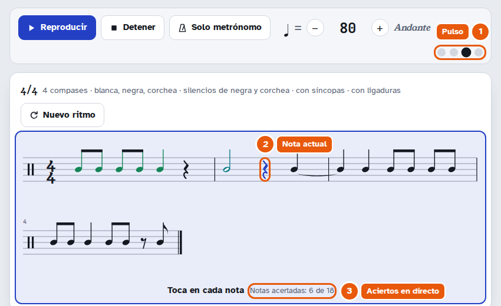

Al pulsar *Practicar* (o tocar la partitura), la partitura se enmarca en azul y suena la cuenta previa (el número aparece sobre la partitura). Después, **toca en cada nota**: sobre la partitura con el dedo o el ratón, o con cualquier tecla del teclado.

1. **Pulso:** las luces siguen al metrónomo.
2. **Nota actual:** el cursor marca la nota que suena; las que ya tocaste se colorean según tu precisión.
3. **Aciertos en directo:** cuántas notas llevas.

Si el ritmo ocupa varias líneas, la página se desplaza sola para que siempre veas la línea que suena y la siguiente. En los silencios y en las notas ligadas no se toca.

### 5. Revisa el resultado

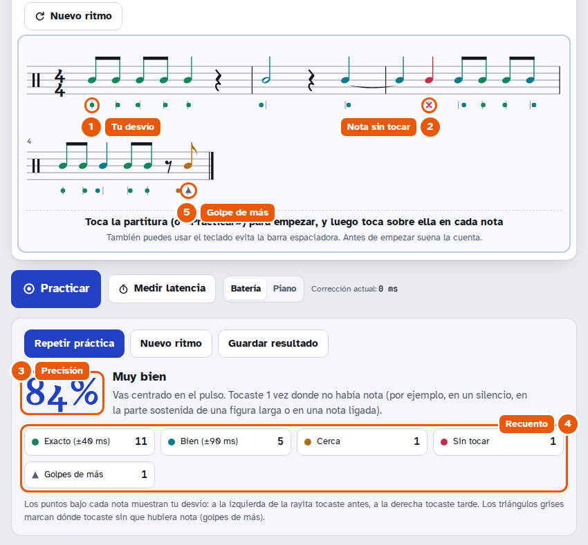

Los botones para repetir la práctica o pedir un nuevo ritmo quedan arriba, junto a la partitura.

1. **Tu desvío:** el punto bajo cada nota indica si tocaste antes (a la izquierda de la rayita) o tarde (a la derecha). Verde = exacto (±40 ms), azul verdoso = bien (±90 ms), naranja = cerca.
2. **Nota sin tocar:** una ✕ roja.
3. **Precisión:** la nota global, con un consejo (si tiendes a adelantarte o atrasarte).
4. **Recuento:** exactas, bien, cerca, sin tocar y golpes de más.
5. **Golpe de más:** un triángulo gris marca dónde tocaste sin que hubiera nota (en un silencio, en la parte sostenida de una figura larga o en una nota ligada).

#### En modo piano

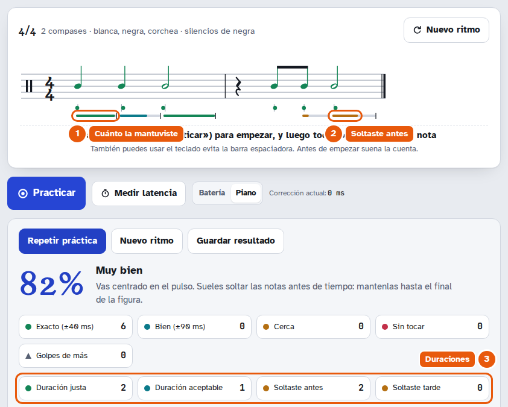

Además del ataque se mide cuándo sueltas cada nota.

1. **Barra de duración:** compara cuánto la mantuviste (color) con lo que debía durar (gris); la rayita marca dónde tenías que soltar.
2. **Soltaste antes:** la barra se queda corta y en naranja.
3. **Duraciones:** justas, aceptables, antes y tarde, con un consejo si sueles soltar pronto o tarde.

### 6. Medir la latencia

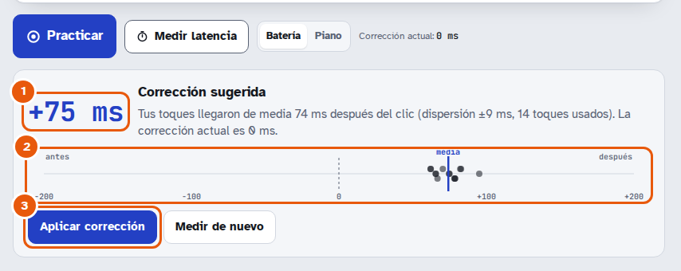

Si siempre te marca «tarde» aunque vayas a tiempo (pasa a menudo con auriculares Bluetooth), pulsa **Medir latencia**: suenan 4 clics de cuenta y tocas con los 16 siguientes.

1. **Corrección sugerida:** cuántos milisegundos llegan tarde tus toques de media.
2. **Cada toque:** dónde cayó cada uno respecto al clic.
3. **Aplicar corrección:** la guarda como *Ajuste de latencia*.

### 7. Campaña

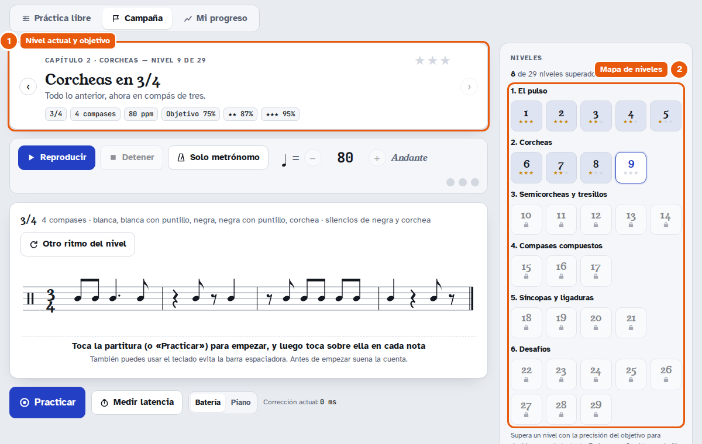

1. **Nivel actual:** qué se practica, compás, tempo fijo y la precisión necesaria para 1, 2 y 3 estrellas.
2. **Mapa de niveles:** 29 niveles en 6 capítulos (El pulso, Corcheas, Semicorcheas y tresillos, Compases compuestos, Síncopas y ligaduras, Desafíos). Cada nivel se desbloquea al conseguir al menos una estrella en el anterior. Los silencios se introducen poco a poco y en *Desafíos* hay niveles de 5/8, 7/8 y 8/8 con distintas agrupaciones y de 3/2.

Al cambiar de nivel, la partitura se centra en la pantalla.

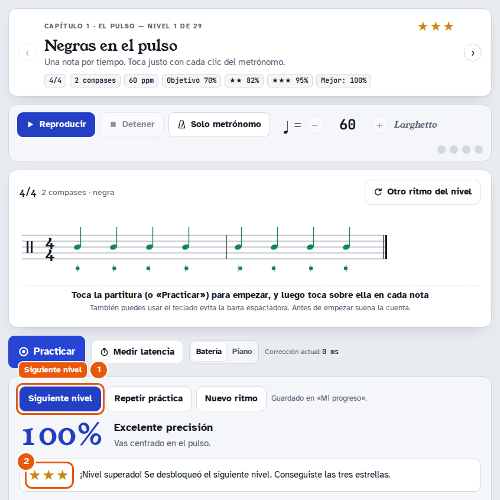

1. **Siguiente nivel:** aparece, como botón principal, cuando superas el nivel.
2. **Estrellas** conseguidas y lo que falta para la siguiente.

### 8. Mi progreso

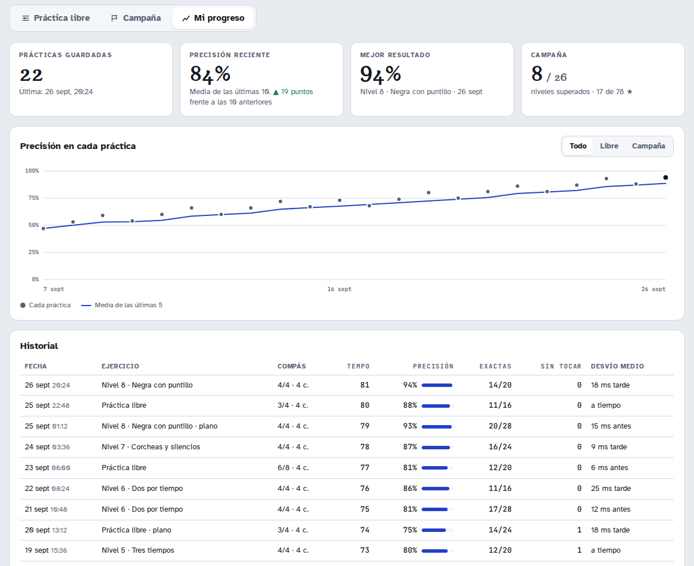

Resumen de tus prácticas, gráfica de precisión con la media de las últimas cinco e historial detallado (incluye la agrupación en los compases de amalgama).

### En el móvil

  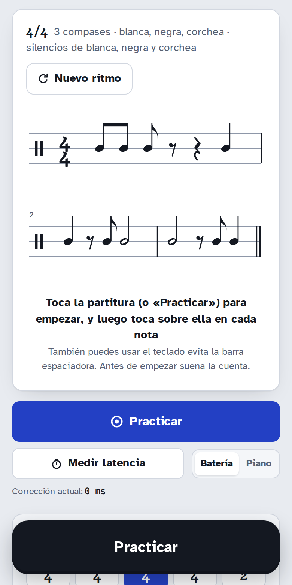
  &nbsp;
  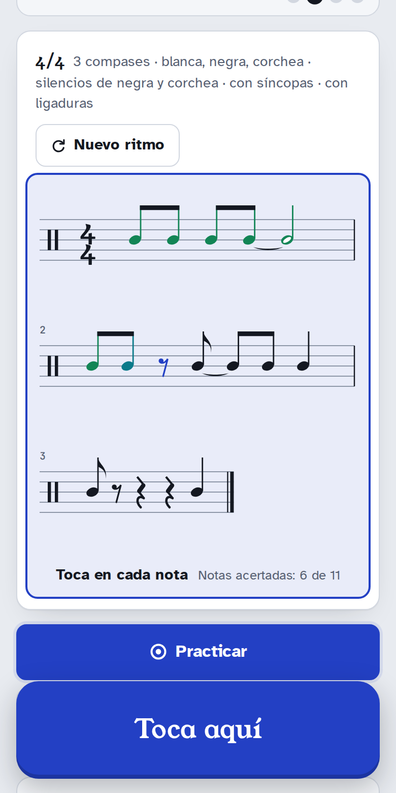

En pantallas pequeñas el panel de opciones pasa debajo de la partitura. En móvil y tableta aparece un **botón grande abajo de la pantalla** mientras la partitura está a la vista:

- **En reposo** dice *Practicar* y empieza la práctica (izquierda).
- **Durante la práctica** dice *Toca aquí* y es donde tocas (derecha): no se mueve cuando la partitura cambia de línea, así no tocas fuera por error. Muestra la cuenta previa y, en modo piano, se mantiene pulsado.

Si prefieres tocar sobre la partitura, desactívalo en *Práctica → Botón flotante para tocar*.

### Teclado

- <kbd>Espacio</kbd> o cualquier tecla: tocar durante la práctica o la medición de latencia.
- <kbd>N</kbd>: nuevo ritmo.

Para el detalle técnico, consulta [`CLAUDE.md`](CLAUDE.md).
